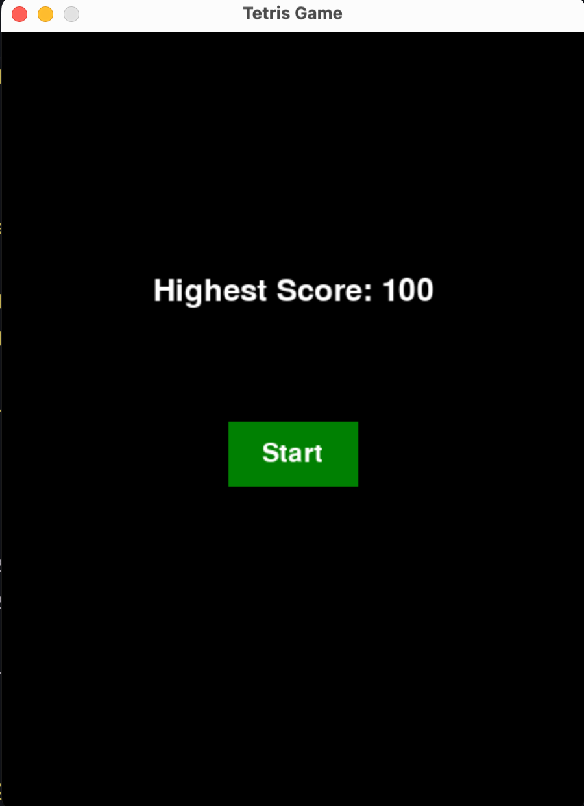
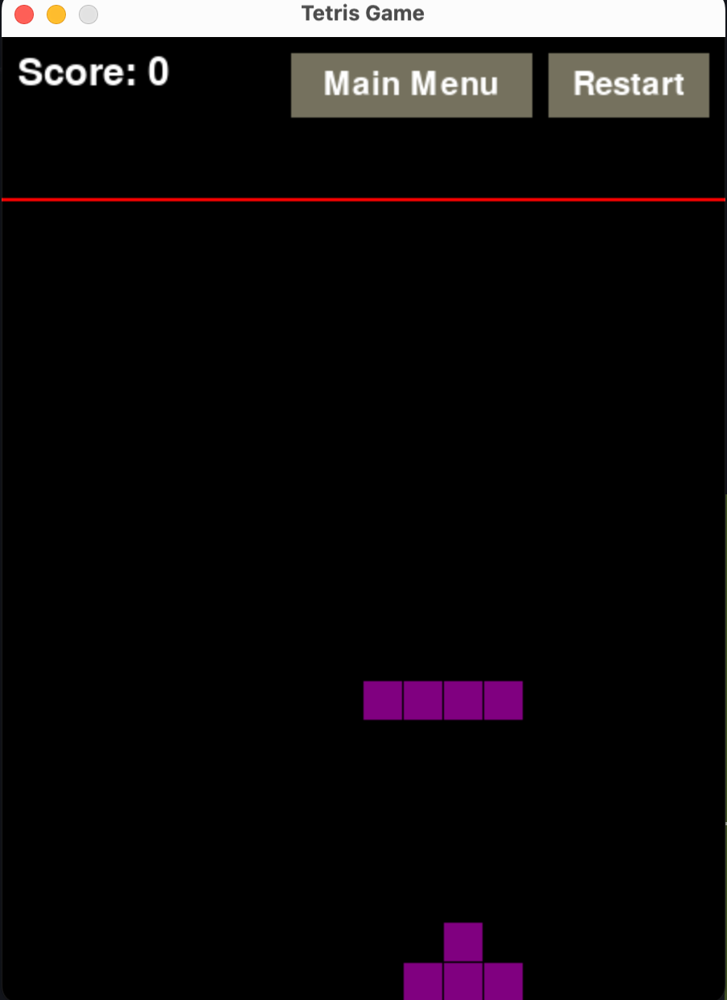

# Tetris Game with Pygame

A classic Tetris game built with Python using the Pygame library. This project aims to recreate the nostalgic experience of the traditional Tetris game with added modern features and an intuitive interface.

## Features
- Classic Tetris gameplay experience
- Easy to navigate main menu with game start and high score display
- Real-time score tracking with high score saving
- Smooth tetromino movements and rotation
- Game over detection with an option to restart or return to the main menu
- Customizable settings for fall speed and control keys

## Installation
To run this Tetris game, you will need Python and Pygame installed on your system.

### Prerequisites
- Python 3.x
- Pygame

### Installing Python
Download and install Python from python.org.

### Installing Pygame
Pygame can be installed using pip. Run the following command in your terminal:

```bash
pip install pygame
```

### Cloning the Repository
Clone the repository to your local machine:

```bash
git clone https://github.com/SarmSKunatham/TetrisPygame.git
```
Navigate into the project directory:

```bash
cd TetrisPygame
```

### Running the Game
Execute the game using Python:

```bash
python src/app.py
```

## How to Play
- Use the arrow keys to move and rotate the tetrominos.
- Press the left arrow key to move the tetromino left.
- Press the right arrow key to move the tetromino right.
- Press the down arrow key to accelerate the tetromino downwards.
- Press the up arrow key to rotate the tetromino.
- The game can be restarted at any time by clicking the "Restart" button.
- Return to the main menu by clicking the "Main Menu" button during gameplay.

## Project Structure
The Tetris game is structured into several key components, each responsible for a specific aspect of the game's functionality. Here's an overview of the main files and directories in this project:

### Main Files
- `app.py`: The entry point of the game. It initializes the game application and starts the game loop.
- `tetris_board.py`: Contains the TetrisBoard class that manages the game state, including the grid, current piece, score, and game-over condition.
- `tetromino.py`: Defines the Tetromino class, representing the individual Tetris pieces, their shapes, colors, and rotation logic.
- `button.py`: Implements a simple Button class used for creating interactive buttons in the game's UI.
- `constants.py`: Stores various constants used throughout the game, such as screen dimensions, colors, and tetromino shapes.

### Key Components
Tetris Application (`TetrisApp` class in `testris_app.py`)
The `TetrisApp` class orchestrates the game's main loop, handling events (e.g., keyboard inputs, button clicks), updating the game state, and rendering the game screen. It also manages transitions between different game states, such as the main menu, playing state, and game-over screen.

Game Board and Logic (`TetrisBoard` class in `tetris_board`.py)
This class is responsible for the core gameplay logic, including managing the grid, current falling tetromino, detecting collisions, clearing completed lines, and checking for game over conditions.

Tetromino Pieces (`Tetromino` class in `tetromino.py`)
Represents the individual Tetris pieces. It stores information about the piece's shape, color, and current rotation state. The class provides methods for rotating the tetromino.

UI Components (`Button` class in `button.py`)
The Button class is a utility class used to create interactive buttons in the game's UI, such as "Start" and "Restart" buttons. It handles rendering the button and detecting clicks.

### How It Works
1. **Initialization**: The game initializes Pygame, creates the main game window, and loads the initial game state.
2. **Game Loop**: The game enters a loop where it continuously checks for user input, updates the game state based on logic in TetrisBoard, and renders the current state to the screen.
3. **User Input**: The game responds to keyboard inputs for controlling the tetromino pieces and mouse inputs for interacting with UI buttons.
4. **Game Over**: When the game detects a game-over condition, it displays a game-over screen and gives the option to restart or return to the main menu.

## Example




## Contributing
Contributions to the TetrisPygame project are welcome! 